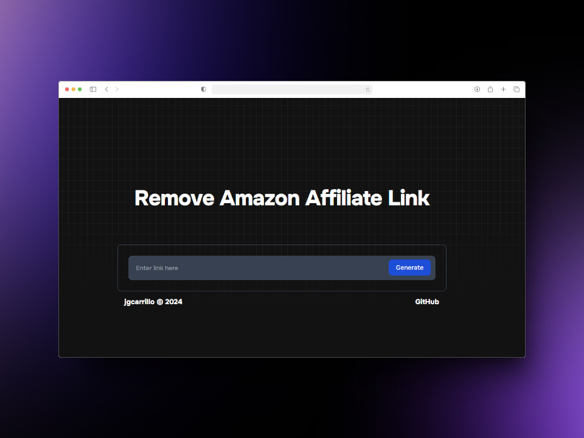

  
  

    <b>
      A simple Amazon Remove Affiliate Link.
    </b>
  

## Motivation

This is a simple webpage to remove Amazon affiliate links. The motivation for this comes from the frustration of living in a world where every link shared on social media is accompanied by an affiliate link. Personally, I have no issue with supporting content creators, but I believe this practice is being taken to the extreme.

If you encounter any problems while using the website, please don't hesitate to contact me or open a PR to fix it.

**This utility does not allow you to remove affiliate links from shortened URLs like `https://amzn.to/83fdewK`**.
